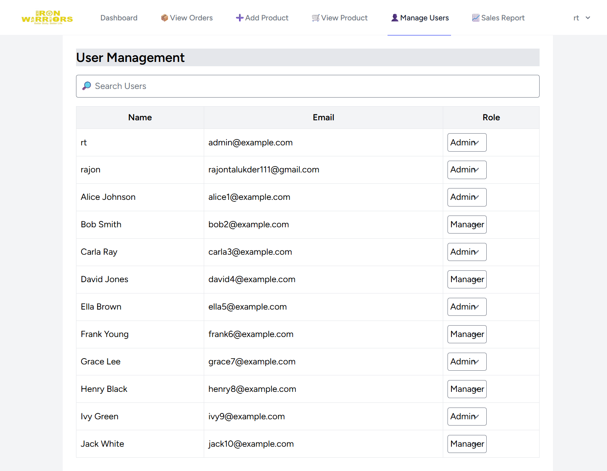
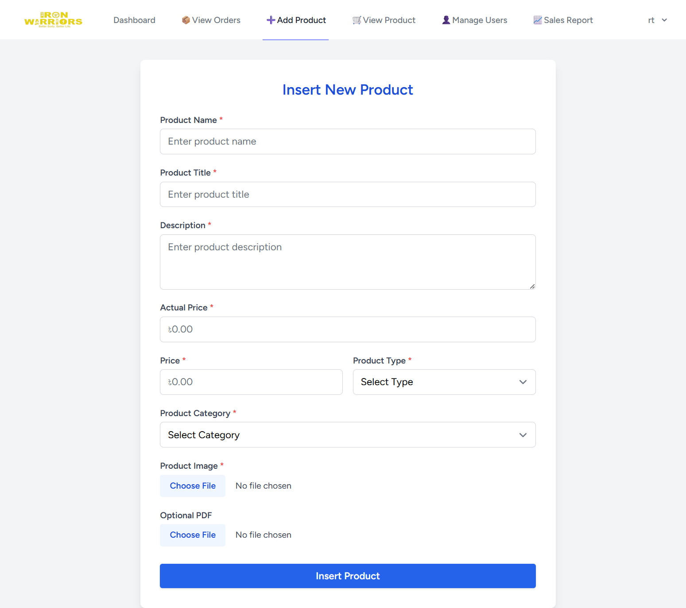
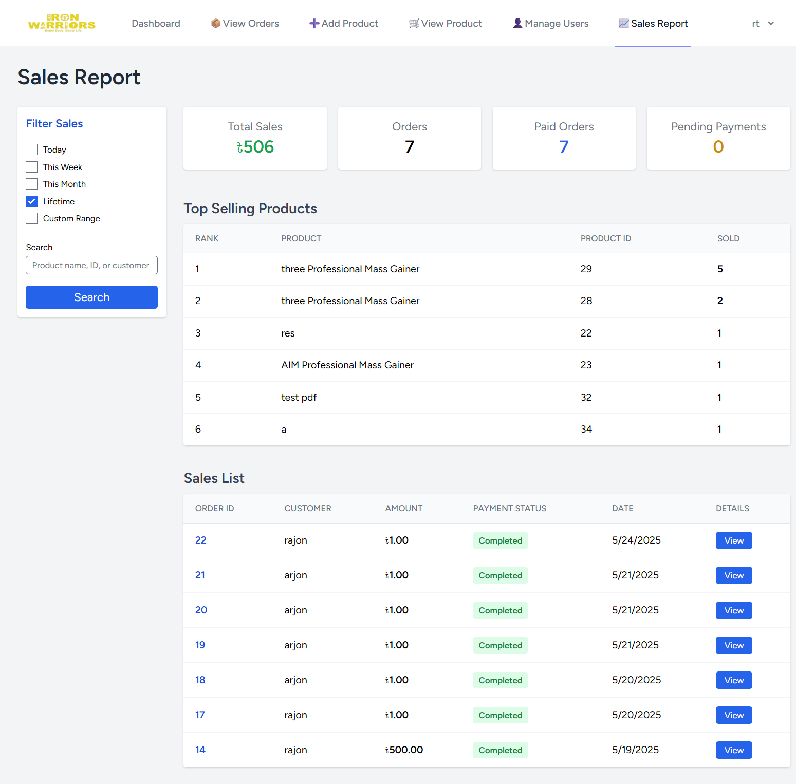
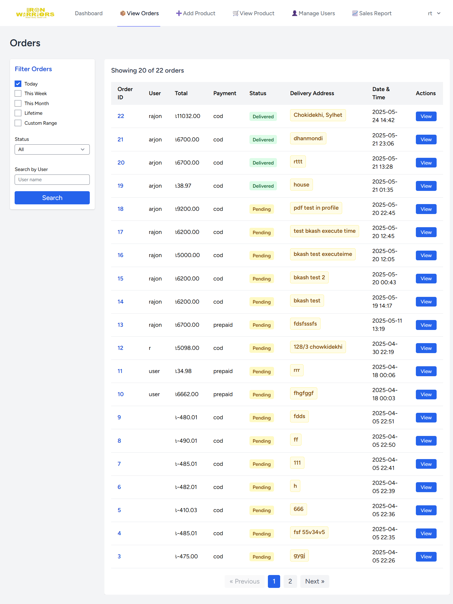

# IronWarriors MyShop — Showcase Admin Dashboard

> Professional showcase of the IronWarriors MyShop Admin Dashboard, designed for HR and recruiter review.

---

## Project Overview

This repository demonstrates the **IronWarriors MyShop Admin Dashboard**, a fully-featured admin panel for e-commerce management. It's intended as a **showcase project** to highlight skills in **full-stack development, role-based access, payment integration, and dashboard design**.

The dashboard presents **realistic workflows and polished UI components**, making it ideal for recruiters and HR professionals to assess technical proficiency and design sense.

## Key Showcase Features

* **Product Management:** Add, edit, delete products; manage categories and inventory.
* **Customer Management:** View profiles, purchase history, and segment users.
* **Order Management:** Workflow from pending to delivered, supporting COD and prepaid payments.
* **Payment Handling:** bKash integration with verification and transaction logs.
* **Analytics & Reports:** Visual insights into sales, top products, and customer behavior.
* **Settings & Configurations:** Shop profile, shipping, tax, discounts, notifications.
* **Role-Based Access:** Super Admin, Manager, Staff roles with demo permissions.

---

## Tech Stack

* **Frontend:** React / Vue / Inertia + Tailwind CSS
* **Backend:** Laravel / Node.js (Express)
* **Database:** MySQL / PostgreSQL
* **Payments:** bKash integration (demo)
* **Storage:** Local or S3-compatible

---

## Demo Setup Instructions

> This is a showcase repository. The code is preloaded with **demo data**. For HR/recruiter preview, local setup is optional.

1. Clone the repository:

```bash
git clone https://github.com/yourorg/ironwarriors-myshop-showcase.git
cd ironwarriors-myshop-showcase
```

2. Optional backend setup (Laravel example):

```bash
composer install
cp .env.example .env
php artisan key:generate
php artisan migrate --seed
```

3. Optional frontend setup:

```bash
cd frontend
npm install
npm run build
```

4. Run servers (if testing locally):

```bash
# Backend
php artisan serve

# Frontend (separate terminal)
npm run dev
```

> Demo accounts and data are already seeded for immediate exploration.

---

## Usage for Showcase

* Access the admin dashboard at `/admin`.
* Explore product, customer, and order modules.
* Review analytics and reporting pages.
* Use demo roles to observe Super Admin, Manager, and Staff permissions.

---

## Screenshots

### Dashboard Overview


### Manage Users


### Add Product


### Sales Report


### Product List


### Order Details


## Database & API Showcase

**Tables:** `users`, `products`, `categories`, `orders`, `order_items`, `transactions`, `coupons`, `shipping_zones`, `activity_logs`.

**API Endpoints:**

* `GET /api/admin/products` — List products
* `POST /api/admin/products` — Add product
* `PATCH /api/admin/orders/:id/status` — Update order status
* `POST /api/admin/transactions/verify` — Verify payment

> All endpoints contain **demo data** for presentation purposes.

---

## Contribution

This repository is meant for showcasing. Contributions can improve documentation, UI presentation, or demo data.

---

## License

MIT License — showcase project for HR and recruiter review.

---

## Contact

Maintainer: Your Name — replace with your professional contact info
Showcase project for IronWarriors MyShop Admin Dashboard
